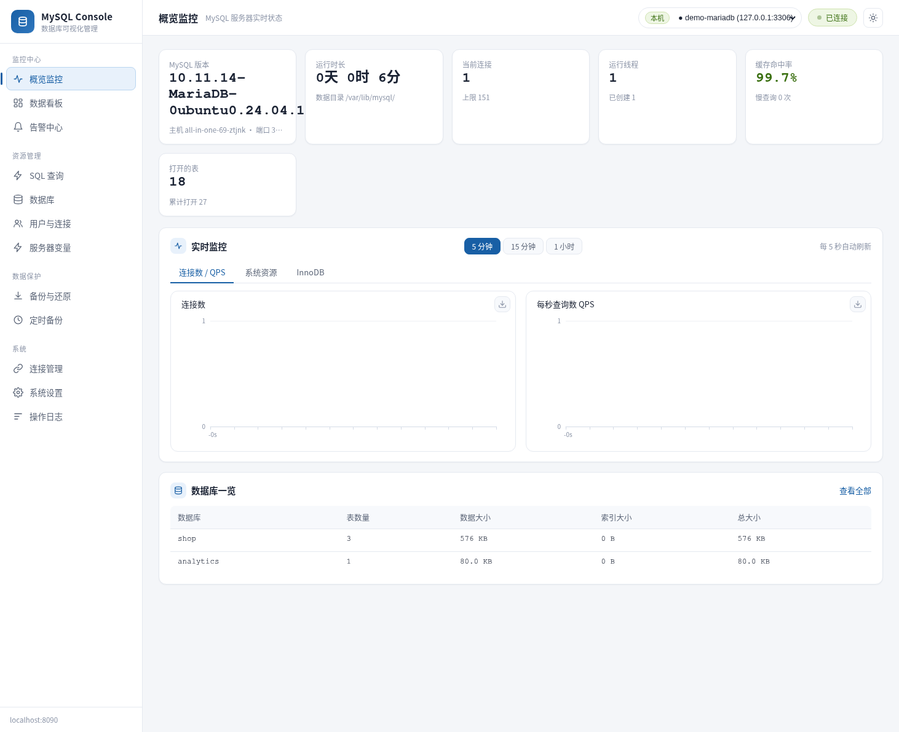
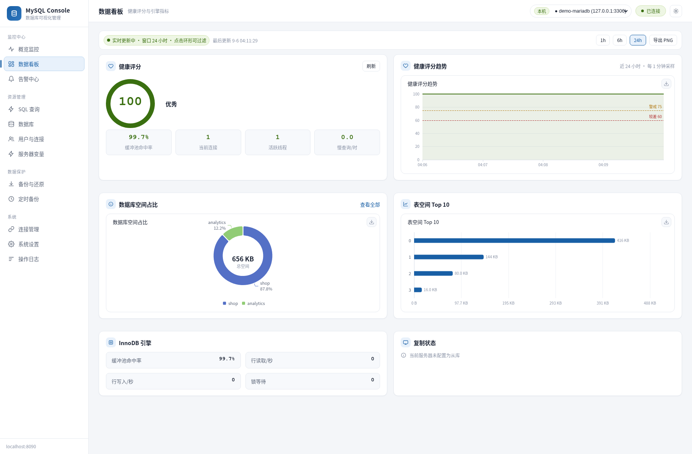
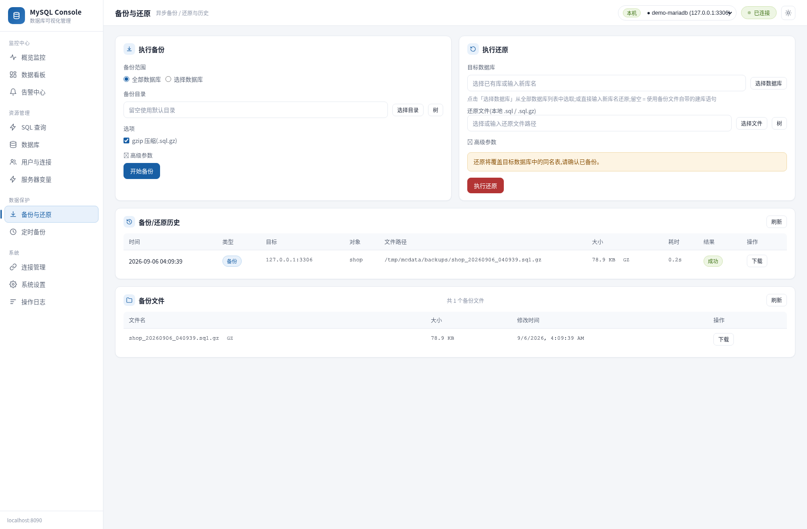
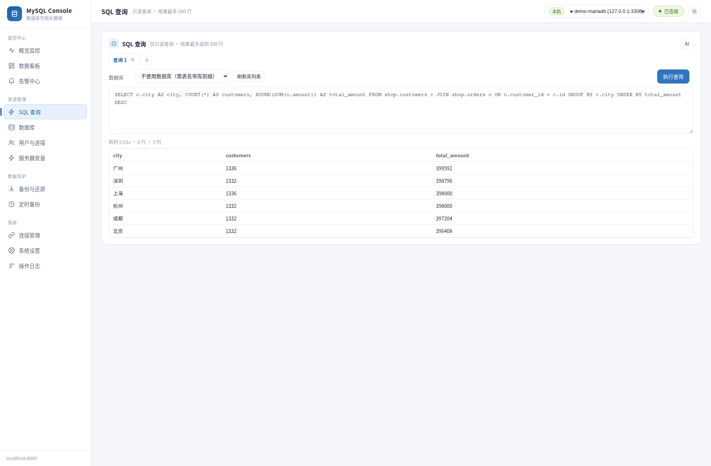

# MySQL Console

<p align="center">
  
</p>

<p align="center">
  <strong>A zero-framework MySQL visual management platform</strong><br>
  A single Python service + a browser covers the full workflow: monitoring, backup, and user management for MySQL<br>
  The managed database can be local or on any network-reachable server — <strong>the deployment machine needs no MySQL installed</strong>
</p>

<p align="center">
  🔖&nbsp;<strong>Language / 语言:</strong>&nbsp;
  <a href="README.md"></a>&nbsp;
  <a href="README.en.md"></a>
</p>

<p align="center">
  <a href="https://github.com/zetsubouk/mysql-console/releases"></a>
  
  
  
  <a href="https://github.com/zetsubouk/mysql-console/actions/workflows/ci.yml"></a>
  
</p>

---

## ✨ Why MySQL Console

Similar tools are either heavy (phpMyAdmin needs PHP + a web server) or require a local MySQL install. MySQL Console strips it down to the essentials:

| | |
|---|---|
| 🪶 **Zero framework** | Served by the Python standard library `http.server`; runtime deps are just `pymysql` + `cryptography`, and the frontend needs no build step |
| 📦 **Installable without Python** | Three-tier resolution: bundled runtime → system Python (isolated venv, **never touches your system**) → auto-download of a private runtime (official source + CN mirrors); the full package skips even the download — fully offline |
| 🖥 **Runs without local MySQL** | Manage a local or remote DB; `mysqldump`/`mysql` clients are probed dynamically at four levels — the wizard tells you exactly what is missing, or downloads them for you |
| 📊 **Progress-tracked backup & restore** | mysqldump streaming pipeline + **byte-level / table-level dual real-time progress** + streaming gzip — not a "spinner waiting for a result" |
| ⏰ **Dual-engine scheduled backup** | Built-in scheduler thread (registration-free) + OS scheduled tasks (schtasks/cron), multi-task with retention policy |
| 🌐 **Truly cross-platform** | Windows / Linux / macOS: one-click install, systemd service, native file dialogs (Win32 / osascript / zenity) |
| 🔐 **Secure out of the box** | Login auth + failure lockout + password recovery; connection credentials Fernet-encrypted; access token enforced and optional TLS for non-loopback deployments |
| 🔄 **Self-updating** | Check GitHub Releases → download & verify → back up → self-update & restart, end to end |

## 🖼 Screenshots

| Data dashboard | Backup & restore |
|---|---|
|  |  |

| SQL query (read-only guard + multi-tab) | Login |
|---|---|
|  |  |

> All screenshots come from the actual running project (MariaDB 10.11 demo data). For an interactive architecture diagram see [docs/architecture.html](docs/architecture.html).

## 🎬 60-Second Experience

```bash
git clone https://github.com/zetsubouk/mysql-console.git
cd mysql-console
./platforms/linux/scripts/install.sh    # Windows: double-click platforms\win64\scripts\install.bat
./platforms/linux/scripts/start.sh      # start the service (release packages ship install/ at the root)
```

Open **<http://127.0.0.1:8090>** in your browser and follow the three-step wizard: **environment check → MySQL client directory → database connection** — then manage your first MySQL.

**Try a progress-tracked backup** (or do it entirely from the UI):

```bash
# Start a backup → a task ID returns immediately (202)
$ curl -s -X POST http://127.0.0.1:8090/api/backup \
    -H 'Content-Type: application/json' -d '{"dbs": ["shop"], "gzip": true}'
{"task_id": "518dc24b6eea", "ok": true}

# Poll progress: byte-level percentage + the table being dumped right now
$ curl -s http://127.0.0.1:8090/api/task/518dc24b6eea
{"id": "518dc24b6eea", "kind": "backup", "status": "done", "phase": "完成",
 "percent": 100.0, "current": "", "message": "备份成功: backups/shop_20260906_040939.sql.gz",
 "detail": "结果: 成功(80.8 KB, 0.2s)", "elapsed": 0.2}
```

> No MySQL to practice on? `tests/e2e/` contains a full backup→restore loop, or see [docs/INSTALL.md](docs/INSTALL.md) to spin up MySQL 8 with Docker.

## 🗺 Architecture Overview

```
Browser SPA (ECharts)  ──HTTP:8090──▶  server.py (ThreadingHTTPServer, 78 REST APIs)
                                        │
        ┌──────────┬──────────┬────────┼──────────┬──────────┐
   mysql_client  backup_   scheduled   config_store  service/   updater
   monitoring/   engine    backup      /system_db   env_probe  self-update
   users/process backup/   dual-engine Fernet enc.   alerts/    Releases
   dashboard    restore    schedule   storage       variables
        │           │         │         │           │
        ▼           ▼         ▼         ▼           ▼
   MySQL Server  mysqldump/  schtasks/ data/(SQLite/ OS API
   (local|remote)  mysql     systemd/  backups/logs) (dialogs etc.)
                 subprocess   cron
                  pipelines
```

- **Component / class / deployment diagrams** (Mermaid, member names verified against source): [docs/wiki/09-class-and-component-diagrams.md](docs/wiki/09-class-and-component-diagrams.md)
- **11 key sequence diagrams** (requests / auth / backup / scheduling / self-update): [docs/wiki/08-sequence-diagrams.md](docs/wiki/08-sequence-diagrams.md)
- **Full architecture doc**: [docs/wiki/01-architecture.md](docs/wiki/01-architecture.md)

## 🚀 Quick Start

> Detailed deployment (dual-platform, auto-start, systemd, remote DB, FAQ) lives in **[docs/INSTALL.md](docs/INSTALL.md)**.

### 1️⃣ Get the project

```bash
git clone https://github.com/zetsubouk/mysql-console.git
cd mysql-console
```

> No Python environment? Pick **standard** (bundled MySQL clients, works out of the box) or **slim** (~600 KB, wizard-guided download/skip) from Releases; or run `install.bat` to auto-download a private runtime (~11 MB, installed only inside the project directory — never touches the system).

### 2️⃣ One-click install + start

Release packages come as a 4-package matrix (`--platform × --variant`) — grab the one you need:

| Package | Example filename | Size | MySQL clients | For |
|---|---|---|---|---|
| normal-win64 | `mysql-console-3.8.1-win64.zip` | ~30MB | Yes (5.7 + 8.x) | Windows, out of the box |
| normal-linux | `mysql-console-3.8.1-linux.tar.gz` | ~30MB | Yes | Linux/macOS, out of the box |
| slim-win64 | `mysql-console-3.8.1-slim-win64.zip` | ~600K | No — wizard downloads/skips | Lightweight |
| slim-linux | `mysql-console-3.8.1-slim-linux.tar.gz` | ~600K | No | Same |

**Windows** (double-click; release packages keep these at the root):

```bat
platforms\win64\scripts\install.bat    :: create .venv + install deps
platforms\win64\scripts\start.bat      :: start the service
```

**Linux / macOS** (linux mode):

```bash
./platforms/linux/scripts/install.sh   # or ./install.sh at the release-package root
./platforms/linux/scripts/start.sh
sudo ./platforms/linux/scripts/install.sh --service   # Linux production: systemd auto-start
```

### 3️⃣ Three-step wizard

Open `http://127.0.0.1:8090` and follow the wizard: **environment check → MySQL client directory → database connection**. On slim packages the wizard offers to **download or skip** the clients (standard packages skip silently).

> Factory reset: `init.bat` / `init.sh` (deletes all config, the system DB, and backups — use with care).

## 📦 Feature Overview

<details open>
<summary><b>Monitoring & Operations</b></summary>

- **Real-time monitoring**: connections / QPS / slow queries / threads, incremental refresh via `/api/monitor` with 5s/15min/1h windows
- **Data dashboard**: health score (0-100), InnoDB analysis, tablespace share & Top-10, replication status
- **Database/table management**: database & table stats, size ranking
- **User management**: MySQL user CRUD, grant editing (with current-state prefill), root protection
- **Process management**: process list, kill connections
- **SQL query**: read-only statement guard (blocks executable comments / WITH+DML / SET GLOBAL / multi-statements), multi-tab, 500-row cap
- **Alert center + server variables**: configurable thresholds, offline Chinese explanations for ~87 common variables
- **AI assistant** (optional): natural-language → read-only SQL, EXPLAIN tuning advice, alert/health reports (OpenAI-compatible endpoints)

</details>

<details open>
<summary><b>Backup & Restore (core)</b></summary>

- Manual backup: full DB / multiple DBs, gzip compression, **byte-level + table-level dual real-time progress**
- Restore: auto-detects whether the bundle contains CREATE DATABASE statements and auto-creates the target DB
- Backup history + file browser + download endpoint (path whitelist prevents arbitrary file reads)
- Scheduled backup: multi-task, retention policy, dual engine (built-in scheduler / OS scheduled tasks)
- **Automatic local/remote storage**: `localhost/127.0.0.1` → writes locally; other hosts → **piped straight to the server over SSH**, no local disk or bandwidth used
- **SSH tunnel**: local port forwarding via a jump host when 3306 is unreachable (key auth only)
- **Bundled MySQL clients**: multi-version (5.7/8.x) matched automatically to the connection's declared DB version family, avoiding cross-version issues

</details>

<details open>
<summary><b>Platform</b></summary>

- Login auth, failure lockout, password recovery, username change
- Dual backend storage: light mode (SQLite, zero DB dependency) / full mode (system DB inside MySQL, switchable)
- MySQL service status detection & restart, system resource (CPU/memory) monitoring
- Self-update (GitHub Releases check / download / verify / backup / restart)
- First-run three-step wizard, `MC_DATA_DIR` data-directory relocation, portable deployment

</details>

## 🧪 Testing & Quality

```bash
npm ci && npm test                 # frontend jsdom + vitest regression (6 suites)
python tests/api/test_api.py       # API-layer regression (isolated data dir, no MySQL needed)
python tests/unit/test_units.py    # offline unit tests (30+ cases)
python tests/e2e/test_e2e.py       # backup → restore end-to-end (needs MySQL)
```

All automated by [`.github/workflows/ci.yml`](.github/workflows/ci.yml): **backend matrix (3.10/3.11/3.12) → cross-platform smoke (Win/macOS) → frontend jsdom → E2E (MySQL 8 container) → systemd container full loop**.

## 📁 Project Structure

```
mysql-console/
├── src/                  # all Python source + static/ (frontend, zero-build)
│   ├── server.py         # HTTP entry: API + static assets + scheduler + native dialogs
│   ├── backup_engine.py  # backup/restore engine (streaming pipeline + progress)
│   ├── mysql_client.py   # PyMySQL query wrapper (monitoring/db/users/processes)
│   ├── config_store.py   # Fernet-encrypted connection config + dual-mode storage adapter
│   ├── system_db.py      # full-mode system DB (6 mc_* tables + StorageBackend)
│   ├── schedule_store.py / native_scheduler.py   # scheduled-backup dual engine
│   ├── env_probe.py / updater.py / runtime_resolver.py / ...
│   └── static/           # index.html / app.js / login.html / ECharts (local)
├── docs/                 # INSTALL / RELEASE / DEVLOG / HANDOFF / architecture.html
├── docs/wiki/            # ⭐ Code Wiki: architecture / modules / API / diagrams
├── platforms/            # single repo, dual dirs: win64 / linux (mac uses linux)
├── scripts/              # shared build scripts (build_release.py / sync_version.py)
├── tests/                # api/ unit/ e2e/ frontend/ vitest — five test types
├── .github/workflows/    # CI pipeline (5 jobs)
├── data/                 # runtime data (not tracked; MC_DATA_DIR can relocate)
└── runtime/              # bundled standalone runtime (not tracked; built in or downloaded)
```

## 📖 Documentation

| Doc | Content |
|---|---|
| ⭐ [docs/wiki/README.md](docs/wiki/README.md) | **Code Wiki hub**: architecture / modules / classes / dependencies / running / API / testing |
| [docs/wiki/01-architecture.md](docs/wiki/01-architecture.md) | Architecture: layers, request lifecycle, threading, auth model |
| [docs/wiki/06-api-reference.md](docs/wiki/06-api-reference.md) | All 78 REST APIs, grouped by domain |
| [docs/wiki/08-sequence-diagrams.md](docs/wiki/08-sequence-diagrams.md) | 11 core sequence diagrams (backup / scheduling / self-update…) |
| [docs/wiki/09-class-and-component-diagrams.md](docs/wiki/09-class-and-component-diagrams.md) | Class / component / deployment diagrams |
| [docs/INSTALL.md](docs/INSTALL.md) | Deployment guide (dual-platform / systemd / remote DB / FAQ) |
| [docs/architecture.html](docs/architecture.html) | System architecture diagram (dark SVG, opens in a browser) |
| [docs/RELEASE.md](docs/RELEASE.md) | Release process |
| [docs/DEVLOG.md](docs/DEVLOG.md) | Development evolution history |
| [docs/HANDOFF.md](docs/HANDOFF.md) | AI/developer handoff guide |
| [docs/MIGRATION.md](docs/MIGRATION.md) | Version migration notes |

## 🤝 Contributing

Issues and PRs are welcome. Please run the [verification checklist](docs/wiki/07-testing-and-ci.md#二改动后验证清单项目约定) after changes; for architecture work read the pitfall list in [HANDOFF.md](docs/HANDOFF.md) first.

## 🔒 Security

Security notes are in **[SECURITY.md](SECURITY.md)**.

## 📄 License

[MIT](LICENSE)
