# 08 · 核心时序图

> **阅读说明**：本页共 11 张时序图（sequence diagram），覆盖系统全部关键运行期交互。图表类型选择理由：描述"跨参与者消息顺序"时序图是最贴合的记法（备选：活动图，适合强调分支与并行，但会丢失参与者边界）。
> - **源格式**：Mermaid（源码即文档，随仓库版本化，可 diff）；
> - **渲染**：GitHub / GitLab / VS Code / Typora 原生渲染，无需插件；如需静态导出可用 `mmdc -i 08-sequence-diagrams.md -o out.svg`（mermaid-cli）；
> - **参与者命名**与源码模块一一对应，行号引用见 [03-classes-and-functions.md](03-classes-and-functions.md)。
> - **配套静态视图**：参与者背后的类/组件/部署结构见 [09-class-and-component-diagrams.md](09-class-and-component-diagrams.md)，其 §0 提供与本页 11 张图的对应关系表。

## 1. 一次 GET API 请求的生命周期

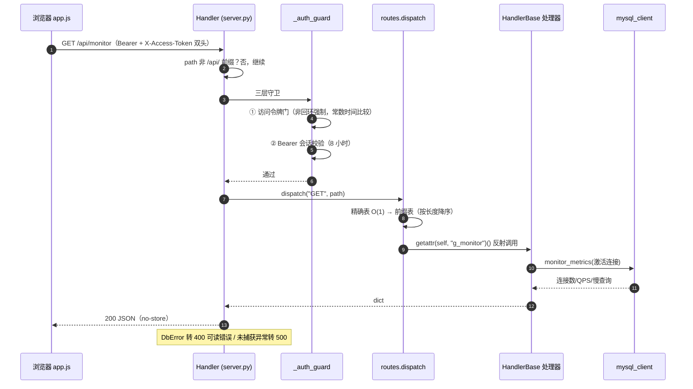

> POST/PUT/DELETE 在第 4 步后额外经过 `_check_csrf()`（Origin/Host 同源校验）。

## 2. 登录与会话签发（三层安全的第一触点）

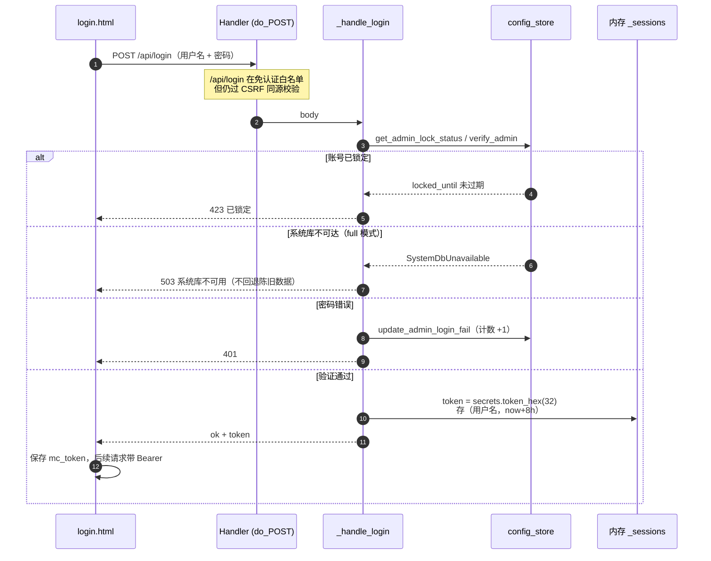

> 找回密码旁路：`POST /api/request-reset-code` 将 6 位验证码**打印到服务端终端**（10 分钟有效、一次性），`POST /api/reset-password` 凭码重置。

## 3. 手动备份：异步任务 + 双维度进度

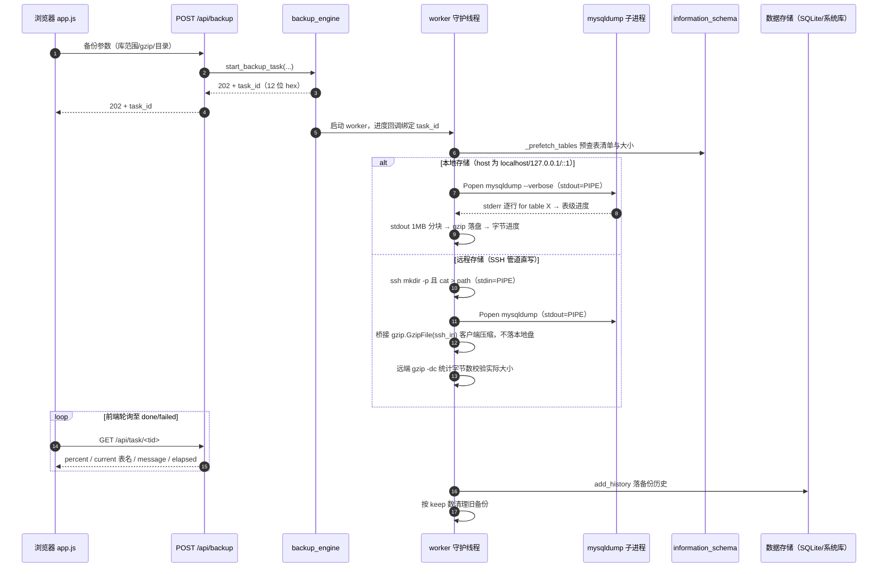

## 4. 还原：建库语句识别 + 自动补建库

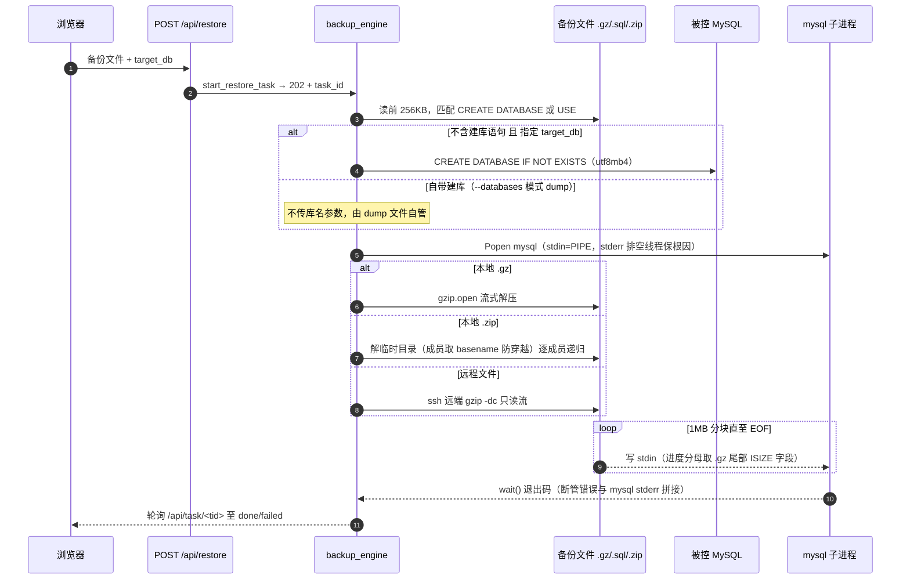

## 5. 定时备份（内置引擎）：20 秒调度循环

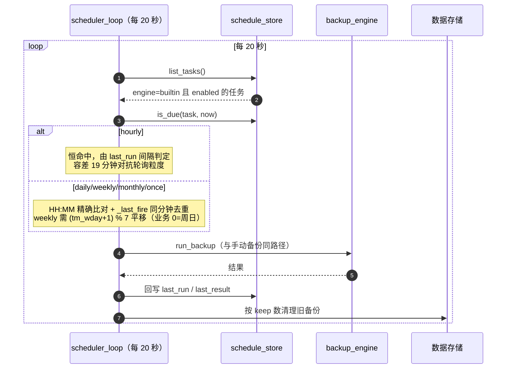

## 6. 定时备份（原生引擎）：注册与 OS 到点执行

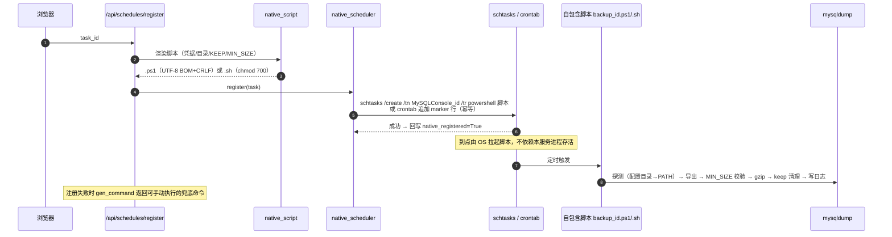

> 引擎一致性：任务 PUT 从 native 改回 builtin 时自动反注册；DELETE 任务前先反注册（[server.py do_PUT/do_DELETE](../../src/server.py#L183-L262)）。

## 7. SSH 隧道：3306 直连不通时的备份链路

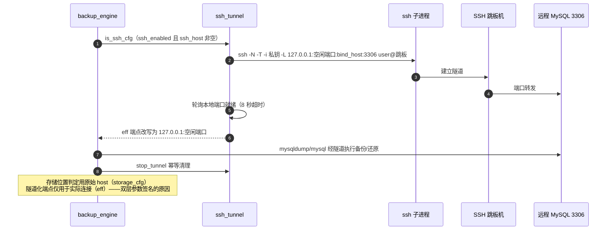

## 8. 软件自更新：check → prepare → apply

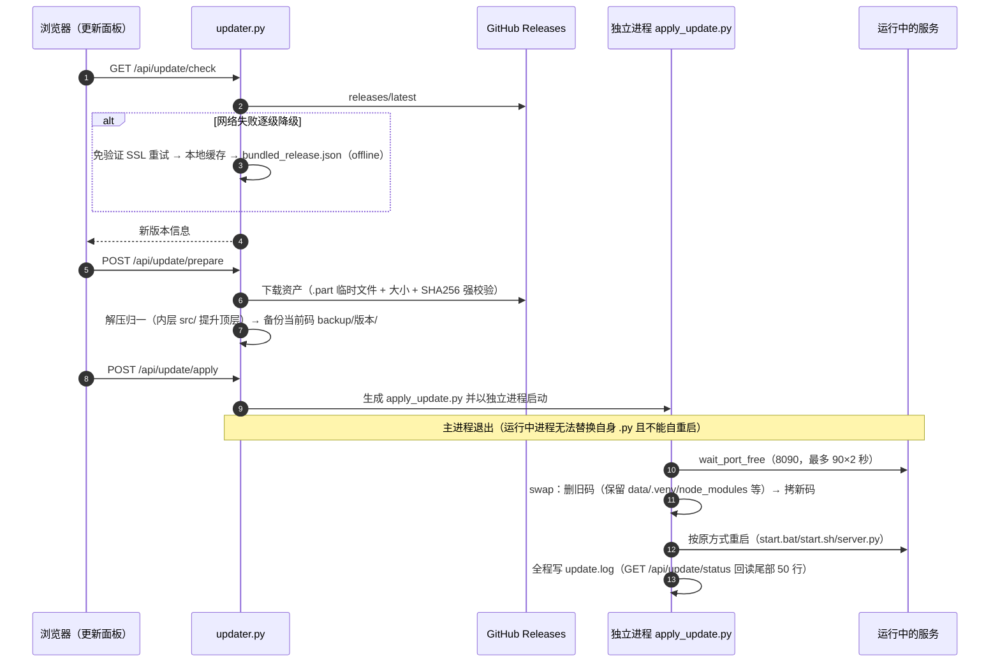

## 9. 首次运行三步向导

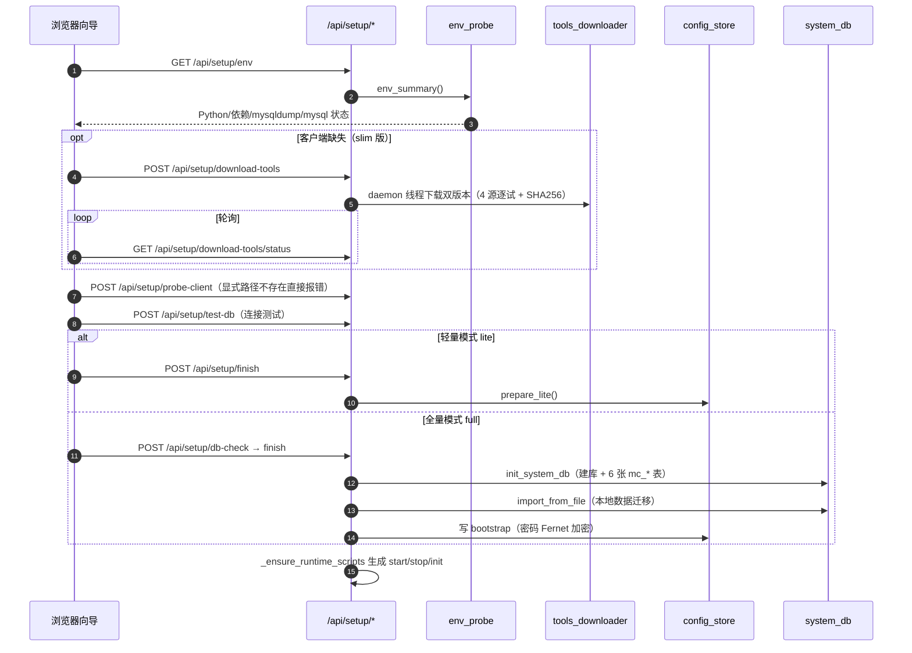

## 10. lite → full 模式切换（不可逆）

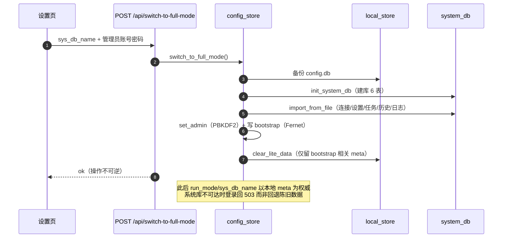

## 11. 只读 SQL 查询与中止

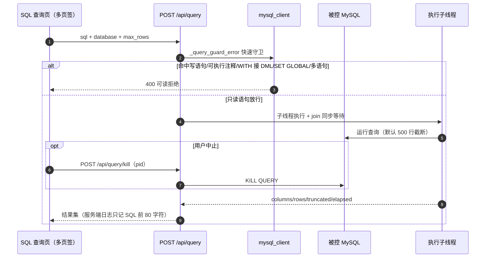

---

## 附：时序图之间的关联

- 图 1 是所有交互的骨架（认证 + 路由分发），图 2/3/4/9/10/11 均复用该骨架；
- 图 3 与图 7 可叠加：远程备份 = 图 7 建隧道 + 图 3 的 SSH 直写分支；
- 图 5 与图 6 互斥：同一任务只会走 builtin（进程内）或 native（OS 调度）其中一条链路；
- 图 8 的 apply 阶段会重启服务，导致内存态（图 2 的会话、图 3 的任务快照）全部失效——这是已知的单机取舍（见 [01-architecture.md §11](01-architecture.md)）。
