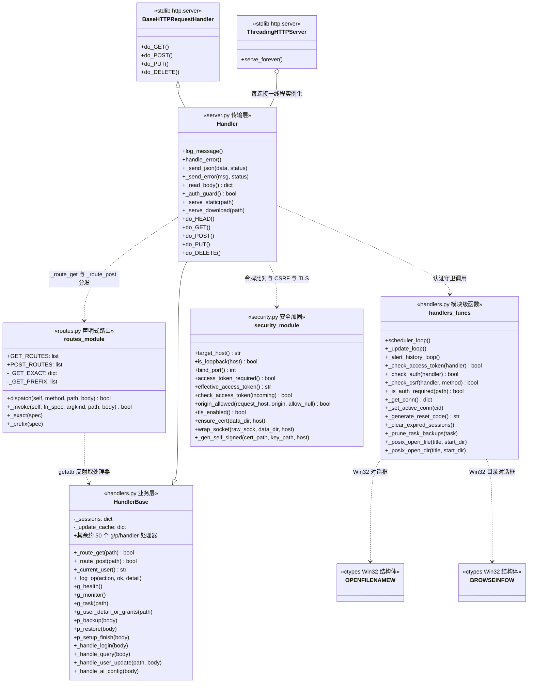
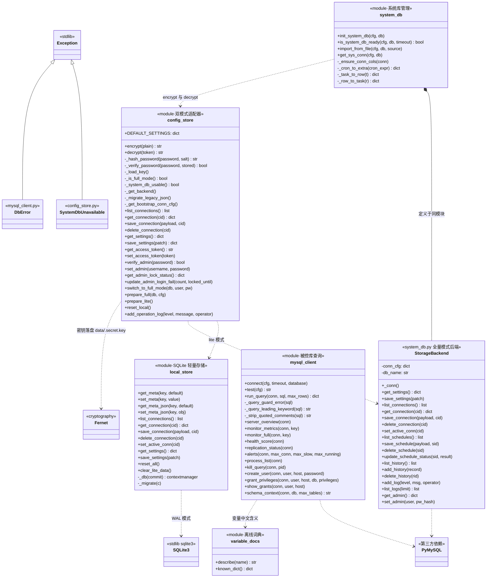
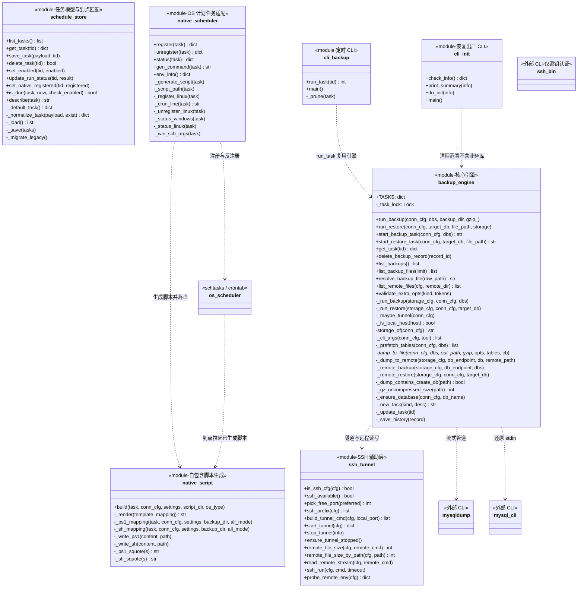
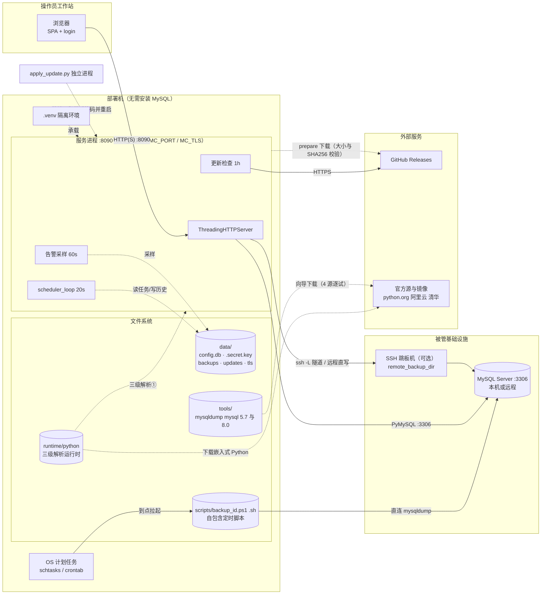

# 09 · 类图与组件图（静态结构视图）

> **阅读说明**：本页为 [08-sequence-diagrams.md](08-sequence-diagrams.md) 时序图对应的**静态结构视图**，共 5 张图。
> - **选型理由**：类图用 Mermaid `classDiagram`（代码级结构，展示真实类/方法名，备选 PlantUML class）；组件图与部署图用 Mermaid `flowchart` 分层子图（备选 Mermaid C4——因 GitHub 渲染兼容性欠佳而未选）。全部成员名经源码 `grep` 核验，非推断。
> - **渲染**：GitHub / VS Code / Typora 原生支持；导出可用 `mmdc -i 09-class-and-component-diagrams.md -o out.svg`。
> - **建模约定**：Python 无类的模块（本项目的多数模块）按 UML «module» 构造型建模，模块级函数列为成员；`-` 前缀表示模块内部函数。

## 0. 与时序图的对应关系

| 静态视图 | 支撑的时序图（08 文档） |
|---|---|
| §1 组件图 | 全部时序图的参与者拓扑总览 |
| §2 类图·HTTP 服务层 | 图 1（请求生命周期）、图 2（登录） |
| §3 类图·数据存储层 | 图 2（verify_admin/锁定）、图 3（历史落库）、图 9/10（向导与模式切换） |
| §4 类图·备份与调度域 | 图 3（备份）、图 4（还原）、图 5（builtin）、图 6（native）、图 7（隧道） |
| §5 部署图 | 图 3/7（执行位置）、图 6（OS 到点拉起）、图 8（apply 换码与重启后的进程关系） |

## 1. 组件图：分层组件视图

```mermaid
flowchart TD
    subgraph FE["前端 SPA（src/static，零构建）"]
        APP["app.js<br/>api() 双认证头 / pollTask 轮询 / ECharts"]
        LOGIN["login.html 登录与找回密码"]
    end

    subgraph CORE["传输与路由层"]
        SRV["server.py<br/>ThreadingHTTPServer + Handler<br/>PUT/DELETE 内联路由"]
        RT["routes.py<br/>39 GET + 39 POST 声明式路由表"]
        SEC["security.py<br/>访问令牌 / CSRF / TLS"]
        PTH["paths.py / version.py"]
    end

    subgraph BIZ["业务层 handlers.py（1745 行）"]
        HB["HandlerBase 约 60 个处理器<br/>g_* / p_* / _handle_*"]
        THR["3 个守护线程<br/>调度 20s / 告警 60s / 更新 1h"]
        DLG["原生文件对话框<br/>Win32 / osascript / zenity"]
    end

    subgraph BK["备份与调度域"]
        BE["backup_engine.py<br/>流式管道 + 双进度 + 任务快照"]
        SST["schedule_store.py<br/>任务模型 + is_due"]
        NSD["native_scheduler.py<br/>schtasks / crontab 注册"]
        NSC["native_script.py<br/>自包含脚本生成"]
        STU["ssh_tunnel.py<br/>隧道 / 远程读写流"]
        CLB["cli_backup.py / cli_init.py"]
    end

    subgraph DATA["数据存储层"]
        CFS["config_store.py<br/>双模式适配 + Fernet + PBKDF2"]
        MYC["mysql_client.py<br/>监控 / 库表 / 用户 / 只读查询器"]
        LST["local_store.py<br/>SQLite data/config.db"]
        SDB["system_db.py<br/>StorageBackend 6 张 mc_* 表"]
        MET["metrics.py 采样落盘"]
        VD["variable_docs.py 离线词典"]
    end

    subgraph PLAT["平台能力层"]
        EPB["env_probe.py 客户端四级探测"]
        UPD["updater.py 自更新"]
        RTR["runtime_resolver.py 三级运行时"]
        TDL["tools_downloader.py 客户端下载"]
        PPB["pip_bootstrap.py pip 引导"]
        SVM["service_manager.py"]
        SYR["sys_resources.py"]
        AIC["ai_client.py"]
    end

    subgraph EXT["外部系统"]
        MYSQL[("被控 MySQL :3306<br/>本机或远程")]
        SYSDB[("MySQL 系统库<br/>_mysql_console")]
        DUMP["mysqldump / mysql CLI"]
        SSHD["ssh / schtasks / crontab"]
        GH["GitHub Releases API"]
        MIR["官方源与国内镜像"]
        AI["OpenAI 兼容 API"]
    end

    APP -->|"HTTP :8090（Bearer + X-Access-Token）"| SRV
    LOGIN --> SRV
    SRV --> RT
    SRV --> SEC
    SRV --> HB
    HB --> RT
    HB -->|"查询/管理"| MYC
    HB -->|"连接与设置"| CFS
    HB -->|"发起备份/还原"| BE
    HB -->|"任务增删与到点扫描"| SST
    HB -->|"注册/反注册"| NSD
    HB -->|"采样读写"| MET
    HB --> DLG
    THR --> SST
    THR --> MET
    CLB -->|"定时任务 CLI"| BE
    BE -->|"定位客户端"| EPB
    BE --> MYC
    BE --> STU
    BE -->|"读取任务/keep"| SST
    BE -->|"子进程管道"| DUMP
    STU --> SSHD
    NSD --> SSHD
    NSC -.->|"OS 到点拉起"| SSHD
    SST -->|"lite 存储"| LST
    SST -->|"full 存储"| SDB
    CFS --> LST
    CFS --> SDB
    MYC --> MYSQL
    MYC --> VD
    SDB --> SYSDB
    SVM -.->|"OS 服务控制"| MYSQL
    UPD --> GH
    TDL --> MIR
    RTR --> MIR
    PPB --> MIR
    AIC --> AI
```

> 阅读要点：`handlers.py` 是唯一触达几乎所有模块的**枢纽**（图 1 时序中"业务层"一步的展开）；`config_store ⇄ system_db` 的双向依赖在图中表现为两条边（延迟 import 化解，见 [04-dependencies.md §2](04-dependencies.md#2-循环依赖与化解手法)）。

## 2. 类图：HTTP 服务层（支撑时序图 1、2）

> 建模要点：`_check_auth`/`scheduler_loop` 等是 handlers.py 的**模块级函数**（接收 handler 参数），不是 HandlerBase 方法——图中以 `handlers_funcs` 单独建模，避免误读。

## 3. 类图：数据存储层（支撑时序图 2、3、9、10）

## 4. 类图：备份与调度域（支撑时序图 3、4、5、6、7）

> 建模要点：`_task_lock` 在源码中声明但从未 acquire（已知问题，见 [01-architecture.md §11](01-architecture.md)），图中如实保留该成员；`os_scheduler → native_script` 的虚线表达"注册一次、OS 到点直接拉起脚本、不经 Python"的时序图 6 关键语义。

## 5. 部署图：运行期拓扑（支撑时序图 3、6、7、8）

> 阅读要点：`OS 计划任务 → 自包含脚本 → MySQL` 是一条**完全绕开服务进程**的执行链（时序图 6 的关键结论：服务停了定时备份照跑）；`apply_update.py` 与服务进程是**父子接力**关系——主进程先退出、独立进程等端口释放后换码再拉起新服务（时序图 8）。

## 6. 视图清单与维护约定

| 视图 | 类型 | 图数 | 对应文档 |
|---|---|---|---|
| §1 组件图 | Mermaid flowchart（分层子图） | 1 | [02-modules.md](02-modules.md)、[04-dependencies.md](04-dependencies.md) |
| §2 HTTP 服务层类图 | Mermaid classDiagram | 1 | [03-classes-and-functions.md §1-3](03-classes-and-functions.md) |
| §3 数据存储层类图 | Mermaid classDiagram | 1 | [03-classes-and-functions.md §6](03-classes-and-functions.md) |
| §4 备份调度域类图 | Mermaid classDiagram | 1 | [03-classes-and-functions.md §4-5](03-classes-and-functions.md) |
| §5 部署图 | Mermaid flowchart | 1 | [05-running.md](05-running.md)、[08-sequence-diagrams.md](08-sequence-diagrams.md) |

> **维护约定**：类图成员来自源码 `grep "^def \|^class "` 实测（2026-09-06，v3.8.1）。重构涉及模块级函数改名/增删时，请同步更新 §2-§4 对应类图；新增跨模块调用建议同步 §1 组件图的边标签。
